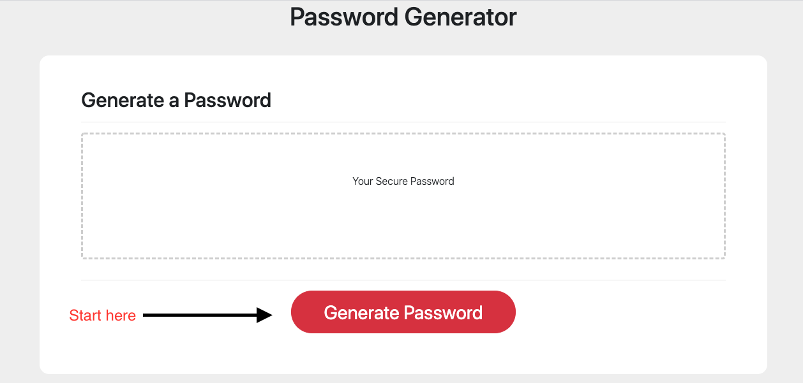

# Employee Encrypted Password Generator

## Table of Contents

* [Introduction](#introduction)
* [Installation](#installation)
* [Style](#style)
* [Old Acquiantances](#Oldacquaintances)
* [New Methods](#newmethods)
* [Credits](#Credits)
* [License](#License)

## Introduction

So, you’ve finally got the job? Congratulations and welcome to the team! I bet you’re ready to dive headfirst into one of many career defining assignments. Before we can excel, we must first complete our employee onboarding paperwork.
The only thing more exciting than your first paycheck, will be the process of completing forms with the unique government-assigned identifiers you’ve been using since birth. Afterwards, we can sit through a week’s worth of protocol meetings, stale scenario re-enactments, and then take quizzes on all of the new information you just saw *ten minutes ago*. Doesn’t this sound great!

That being said, one of the hardest steps in this process involves creating the login information you use to access your employee portal. Back in the day, companies often did this for you. However, being that you now work for a more progressive company, we’ll let you take on this daunting task by yourself! 
While usernames are often easy to create, passwords need a little more thought. Afterall, if a password is too simple, a hacker can easily access accounts and steal social security numbers, direct-deposit information, email and housing addresses, and much more. That’s where the Employee Encrypted Password Generator can be of service.

Let us create your password, so you can just worry about getting through the onboarding process!

I kept the website design simple to provide a smooth experience for the user. All you have to do is press the red button and give the website the parameters you want your password to follow. Once you have finished, you’ll be presented with your new password. If only taxes were this easy!

## Installation

[Click here](https://aikeh2021.github.io/Employee-Encrypted-Password-Generator/) to have the link open in your webpage. Be sure to click the red “Generate Password” button when you’re ready to get started. Don’t forget to bring a pen and paper to write the password down for use later (assuming you’re not using a personal device).

If you would like to view the specific code used to create this website, please [click here](https://github.com/Aikeh2021/Employee-Encrypted-Password-Generator) to access the repository on Github. 

## Style

The design of this website is very simple! The red button was a fantastic choice to draw the user’s eye directly to where they should be interacting with the page. Being that there are no instructions included on the initial website, it’s important the user can easily see where to get started.

## Old Acquaintances

I really enjoyed styling this website because it gave me the opportunity to work with the bootsrap grid system again. I liked this experience because there were so few elements on the page to style. It allowed me to apply the knowledge I have on a much easier to follow website. Because of the simplicity of the design, I could make a change and see exactly what it impacted. I also was still able to use the dev tools so designing the website only took me a few hours. My sense of confidence feels like it’s improving in terms of styling a website. 

## New Methods

I can definitely say my new study methods are greatly helping with my understanding of the material. Now that I am reviewing lectures the day after they occur, I have time to begin my homework and ask questions on things I don’t understand. I hope I am able to keep applying these methods on future units. It also helps me feel less overwhelmed. Rather than having to review all of the lectures before starting my homework, I just look over my notes from the lectures. If anything is unclear, I ask a TA for help and record what I learned in my notes in case the issue comes up again. 

## Credits
[Password Special Characters](https://owasp.org/www-community/password-special-characters)
[Get Bootstrap](https://getbootstrap.com/docs/4.5/getting-started/introduction/)
[How To Center A Button](https://www.youtube.com/watch?v=uICsP_UInps)
[How To Create A Round Button](https://www.w3schools.com/howto/howto_css_round_buttons.asp)
[Border-Radius For Round Corners](https://www.w3schools.com/css/css3_borders.asp)
[Horizontal Line Tag](https://www.w3schools.com/tags/tag_hr.asp)

