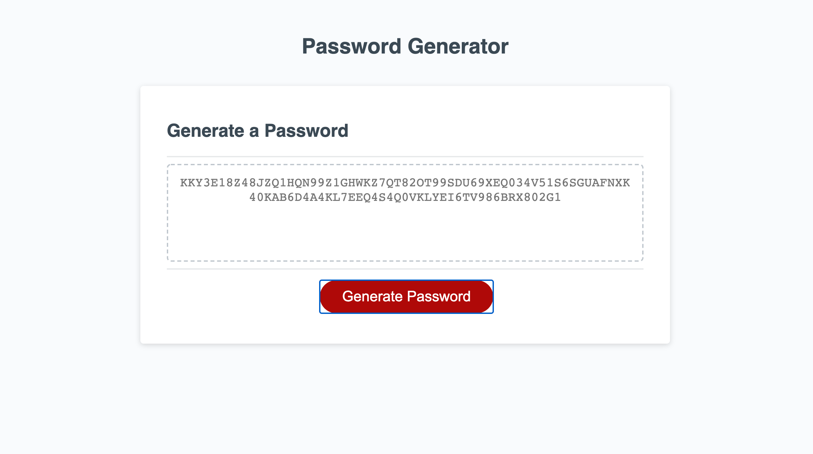

# Employee Encrypted Password Generator

## Table of Contents

* [Introduction](#introduction)
* [Installation](#installation)
* [Style](#style)
* [Old Acquiantances](#old-acquaintances)
* [New Methods and Roadblocks](#new-methods-and-roadblocks)
* [After Some Time . . .](#after-some-time...)
* [Credits](#Credits)
* [License](#License)

## Introduction

So, you’ve finally got the job? Congratulations and welcome to the team! I bet you’re ready to dive headfirst into one of many career defining assignments. Before we can excel, we must first complete our employee onboarding paperwork.
The only thing more exciting than your first paycheck, will be the process of completing forms with the unique government-assigned identifiers you’ve been using since birth. Afterwards, we can sit through a week’s worth of protocol meetings, stale scenario re-enactments, and then take quizzes on all of the new information you just saw *ten minutes ago*. Doesn’t this sound great!

That being said, one of the hardest steps in this process involves creating the login information you use to access your employee portal. Back in the day, companies often did this for you. However, being that you now work for a more progressive company, we’ll let you take on this daunting task by yourself! 
While usernames are often easy to create, passwords need a little more thought. Afterall, if a password is too simple, a hacker can easily access accounts and steal social security numbers, direct-deposit information, email and housing addresses, and much more. That’s where the Employee Encrypted Password Generator can be of service.

Let us create your password, so you can just worry about getting through the onboarding process!

I kept the website design simple to provide a smooth experience for the user. All you have to do is press the red button and choose from up to four criteria that you want your password to follow. Once you have finished, you’ll be presented with a unique password for use at your discretion. If only taxes were this easy!

## Installation

[Click here](https://aikeh2021.github.io/Employee-Encrypted-Password-Generator/) to have the link open in your webpage. Be sure to click the red “Generate Password” button when you’re ready to get started. Don’t forget to bring a pen and paper to write the password down for use later (assuming you’re not using a personal device).

If you would like to view the specific code used to create this website, please [click here](https://github.com/Aikeh2021/Employee-Encrypted-Password-Generator) to access the repository on Github. 

## Style

The design of this website is very simple! The red button seemed like a the right choice to draw the user’s eye directly to where they should be interacting with the page. Being that there are no instructions included on the initial website, it’s important the user can easily see where to get started. After the user has started the generator, they need only answer a few questions before being shown their password in bold and easy to read text. The usability is so direct this site could be useful to people of any age and any skill level.

## New Methods and Roadblocks

I can definitely say my new study methods are greatly helping with my understanding of the past material. 
Unfortunately, I have hit another roadblock. My new method, though effective, is quite time consuming. In addition, I find it has not been so helpful with the current unit. I don't understand what I am doing and I am stumped on how to move forward. 
I think I don't understand a lot of the terms being used in class and it's hindering my understanding because I have a hard time implementing ideas and terms I have never seen before. Not to mention, the volume of new concepts is large and one day of review on my own between classes is not enough for me to understand. I need to find a new way to understand the material so I don't fall further behind. 
I think I am going to revisit this homework and keep working on it on my personal device's visual studio code. I sometimes find that time and repetition are what I need to make the material click. I find that sometimes walking away from an assignment and looking at it after some time off, helps me see an issue with new eyes. And during my break, I review and Google things I didn't understand so that I'm still improving my knowledge while I'm away. In this instance, I wasn't even able to begin the javascript because I keep getting caught up in the names of the terms and what each thing does. After a few days of trying, I didn't know what to do anymore. 
I hope that eventually I will be able to get my code to work especially since I know I will have to use it again in the future. 

## After Some Time . . .

Sometimes time does heal all wounds. All puns aside, after some time the reviews of vanilla javascript began to solidify in my memory. In addition to my Google abilities and improved study methods, I have finally started to get a better grasp on how to complete this actitivity. I may revisit in the future to see if I can apply a switch case to reduce some of the repetition in the code. But for now the code works and I am pleased. 

## Credits

* [Password Special Characters](https://owasp.org/www-community/password-special-characters)
* [Get Bootstrap](https://getbootstrap.com/docs/4.5/getting-started/introduction/)
* [How To Center A Button](https://www.youtube.com/watch?v=uICsP_UInps)
* [How To Create A Round Button](https://www.w3schools.com/howto/howto_css_round_buttons.asp)
* [Border-Radius For Round Corners](https://www.w3schools.com/css/css3_borders.asp)
* [Horizontal Line Tag](https://www.w3schools.com/tags/tag_hr.asp)
* [How To Add Arrays Together](https://www.w3schools.com/jsref/jsref_concat_array.asp)
* [GIF ReadMe Add-ons](https://medium.com/@josephcardillo/how-to-add-gifs-to-your-github-readme-89c74da2ce47)
* [Changing Textarea Placeholder Text With JS](https://www.w3schools.com/jsref/prop_textarea_placeholder.asp)
* [Switch Case Syntax](https://www.w3schools.com/js/js_switch.asp)
* [Randomly Picking An Item From An Array](https://www.kirupa.com/html5/picking_random_item_from_array.htm)

## License

MIT License

Copyright © 2020 [Ashley Ikeh](https://github.com/Aikeh2021)

Permission is hereby granted, free of charge, to any person obtaining a copy
of this software and associated documentation files (the "Software"), to deal
in the Software without restriction, including without limitation the rights
to use, copy, modify, merge, publish, distribute, sublicense, and/or sell
copies of the Software, and to permit persons to whom the Software is
furnished to do so, subject to the following conditions:

The above copyright notice and this permission notice shall be included in all
copies or substantial portions of the Software.

THE SOFTWARE IS PROVIDED "AS IS", WITHOUT WARRANTY OF ANY KIND, EXPRESS OR
IMPLIED, INCLUDING BUT NOT LIMITED TO THE WARRANTIES OF MERCHANTABILITY,
FITNESS FOR A PARTICULAR PURPOSE AND NONINFRINGEMENT. IN NO EVENT SHALL THE
AUTHORS OR COPYRIGHT HOLDERS BE LIABLE FOR ANY CLAIM, DAMAGES OR OTHER
LIABILITY, WHETHER IN AN ACTION OF CONTRACT, TORT OR OTHERWISE, ARISING FROM,
OUT OF OR IN CONNECTION WITH THE SOFTWARE OR THE USE OR OTHER DEALINGS IN THE
SOFTWARE.

